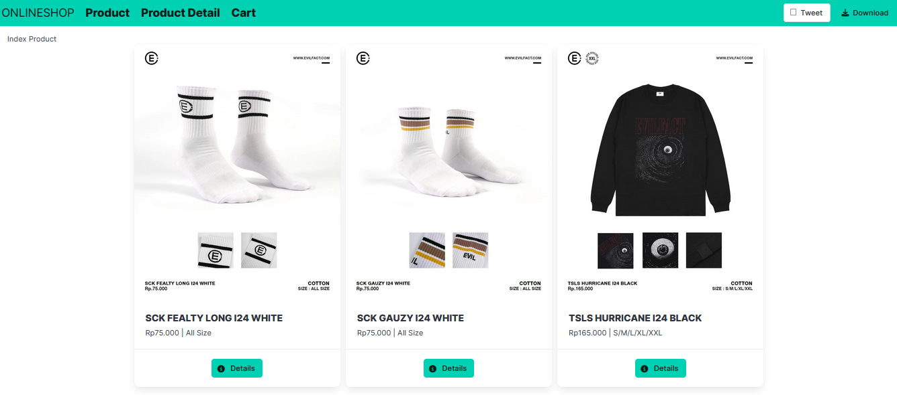

# FullStack OnlineShop MEVN

FullStack Final Project from codepolitan - MongoDB, Express, Vue, NodeJS (MEVN)

# About

JavaScript merupakan teknologi yang berkembang dengan cepat. Sampai dengan sekarang JavaScript gak cuma dipake di sisi browser atau frontend, tapi mampu juga untuk mengatasi data di sisi server atau backend. Di seri tutorial kali ini kita akan membahas teknologi JavaScript mulai dari frontend menggunakan Vue.js dan bagian backend menggunakan Express.js. Database yang digunakan pun adalah MongoDB jadi akan lebih cocok dengan teknologi yang mulai booming digunakan atau disingkat dengan MEVN Stack.

Dengan studi kasus shopping cart diharapkan teman-teman lebih mudah untuk memahami dan sebagai contoh untuk project selanjutnya. Selamat belajar

# Tujuan Umum dan Khusu Pelatihan

-
-
-


# Silabus

- Persiapan Software yang dibutuhkan NodeJS - Visual Studio Code (Extension: Vetur, Volar Labs, Vue Official, ESLint) - MongoDB Community Server (NoSQL) 
- Instalasi Vue CLI dan Project, untuk instalasinya silahkan kunjungi situs resmi dokumentasi VueJS https://vuejs.org/guide/quick-start.html
- Membuat Halaman Yang Dibutuhkan Vuestore (membuat file vue dan konfigurasi routesnya di file app.js)

   ### Structure Folder
   ```
    .
    ├── ...
    ├── src                     # source folder
    │   ├── ...         
    │   ├── routes              # Folder Routes (untuk mempermudah mengakses tiap halaman terdapat file app.js)
    │   └── views               # Folder Halaman yang ditampilkan
    |      ├── cart             # Untuk Halaman Cart (di dalamnya terdapat index.vue)
    |      ├── product          # Halaman Produk Detail dan Index produk (ProductDetail.vue & ProductIndex.vue)
    └── ...
  ```
  > structure folder yang bisa di ikuti

## konfigurasi routes tiap halaman
```javascript
import { createWebHistory, createRouter } from "vue-router";
import product from "../views/product/ProductIndex.vue";
import productDetail from "../views/product/ProductDetail.vue";
import cart from "../views/cart/Index.vue";

const routes = [
  { path: "/product", name: "Product", component: product },
  { path: "/product/:id", name: "Detail", component: productDetail },
  { path: "/cart", name: "Cart", component: cart },
];

const router = new createRouter({
  history: createWebHistory(),
  routes,
});

export default router;
```

- Menampilkan Data Product dari JSON (dapatkan semua file assets nya, buat data-seed.js dalam bentuk object, dan tampilkan datanya di ProductIndex.vue)

 ```   
.
├── ...
├── src                          # source folder
│   ├── assets         
│   │   ├── ProductImg           # Berisi gambar-gambar produk yang ingin ditampilkan
│   ├── ...
│   ├── ...
│   ├── data-seed.js             # file yang berisi data JSON atau object dari assets
└── ...
```
    > structure folder yang bisa di ikuti


## hasil tampilan produk


- Menampilkan Data Produk Berdasarkan ID Produk (membuat halaman ProductDetail.vue, deklarasikan ref() computed() dan useRoute())
```javascript
// API Preference (VUEJS Dokumentation) ini adalah Composition API bukan Option API 
import { products } from '@/data-seed';
import { computed, ref } from 'vue';
import { useRoute } from 'vue-router';
const route = useRoute()

const barangs = ref(products)
const isProductFound = computed(() => {
  return barangs.value.some(brg => brg.id === route.params.id)
});
// 1. ref() merupakan fungsi dari vue3 composition api untuk membuat data REAKTIVE yang menyimpan nilai primitif atau object
// 2. computed() merupakan menghitung nilai berdasarkan state reakitf
// 3. useRoute() sebuah memungkinakn kita untuk mengakses data-data yang terkait dengan URL yang sedang dikunjungi oleh penggune.
```


# Metode Belajar

- Pmebelajaran Mandiri Online: Kamu dapat menentukan sendiri waktu belajarmu
- Materi Berupa Video: Materi pembelajaran disajikan dalam bentuk video yang mudah dipahami
- Forum Tanya Jawab: Fasilitas untuk berdiskusi dan bertanya mengenai materi pelajaran

Kelas ini cocok untuk siapa saja yang tertarik dalam pengembangan aplikasi web dan ingin mempelajari MongoDB sebagai database, Express web framework backend, Vue 3 sebagai javascript framework dan terakhir NodeJS sebagai Runtime. Dengan mengikuti kelas ini, kamu akan memperoleh keterampilan yang diperlikan untuk membangun aplikasi web yang modern dan kompleks.

## Feature in App

-
-
-
